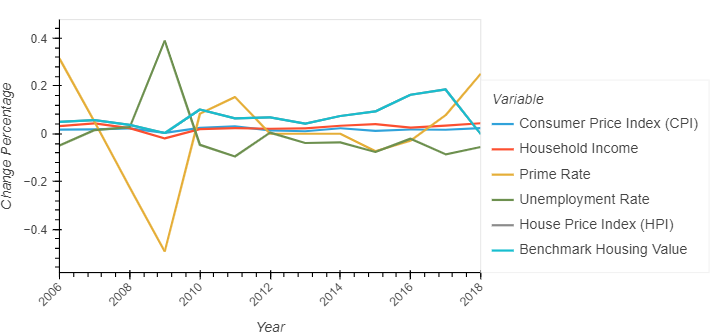
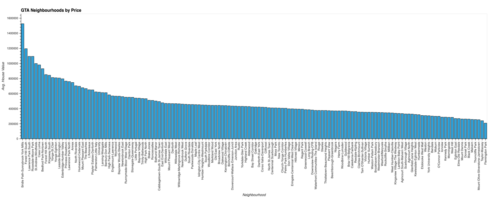
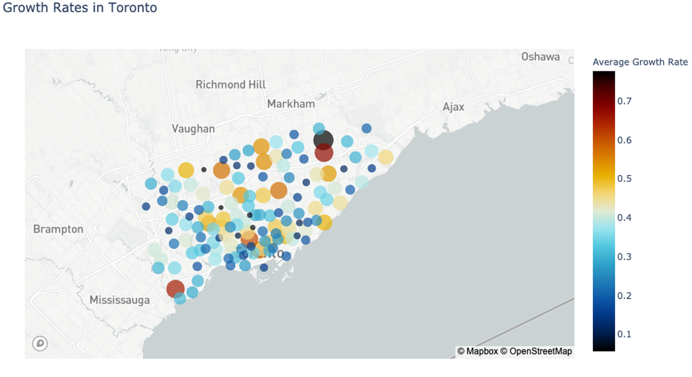
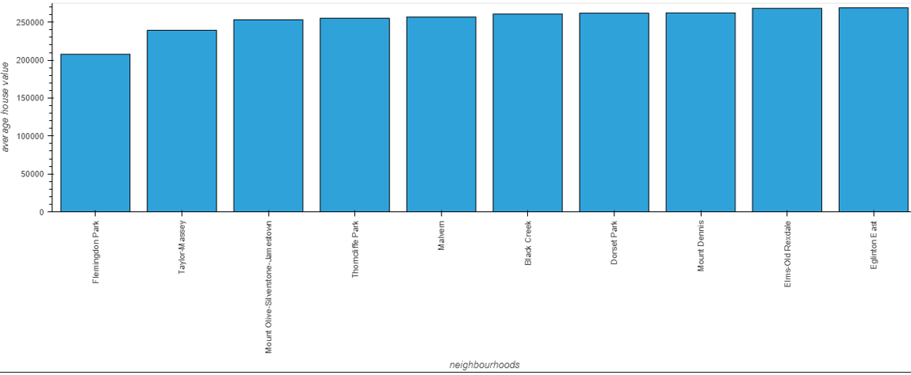
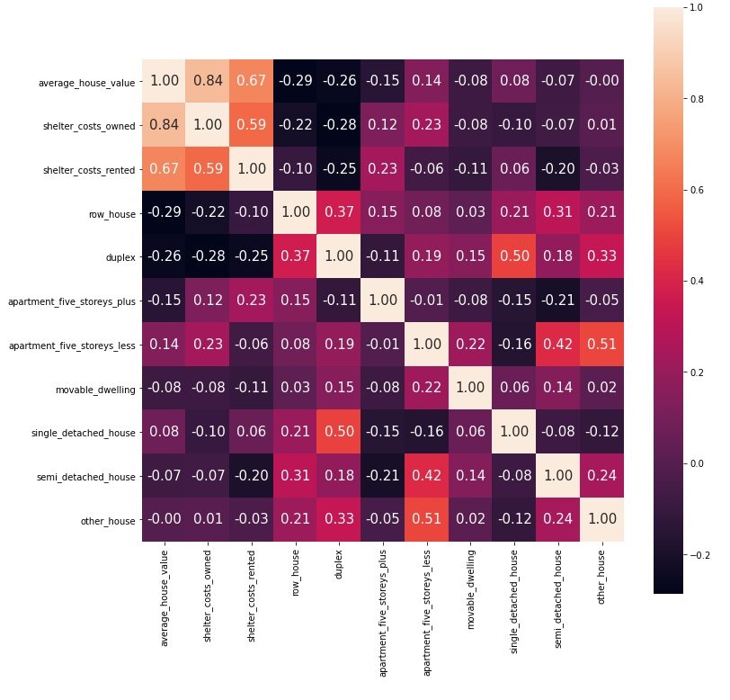
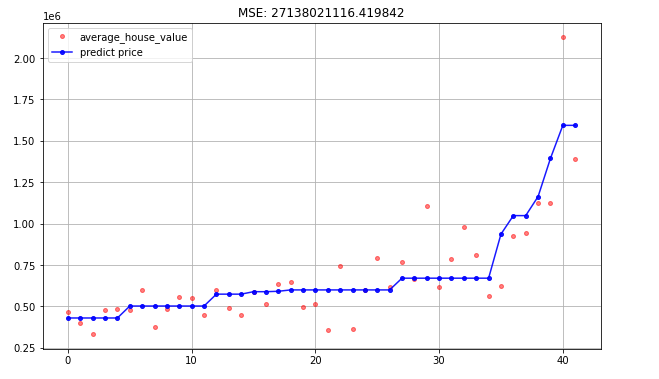

## Project 1 - Group 4

## Analysis and Model to Predict Future Housing Price of Toronto Neighborhoods

Housing price is always a hot topic to discuss no matter you are a buyer or seller. Our analysis aims to explore what the key factors are and how they influence the pricing from both macro and micro aspects. Our report also reviews the current market and predict the future pricing by neighborhoods throught Decision tree Regression Machine Learning methodology.   

## Questions and Findings

1-	 What are the key macro factors for the housing price? How these factors impact on housing price historically?– (Grace)
  Key factors: Consumer Price Index (CPI), Unemployment, Household income, Prime rate, etc.

2-	 What are the most expensive neighborhoods in Toronto? – (Ali)

3-	 How the housing prices increased by neighborhoods? (Growth rate) - (Ali)

4-	 Which neighborhoods are the most affordable? What tpye of housing are the most affordable? - (Fernanda)

5-	 Prediction for the future housing prices of Toronto by neighborhood - (Muhammad)

Methodology: Cluster based analysis – K-means clustering is one of the simplest and popular unsupervised machine learning algorithms. In other words, the K-means algorithm identifies k number of centroids, and then allocates every data point to the nearest cluster, while keeping the centroids as small as possible.

## Variables:

Primary rate;
Household income;
Consumer Price Index (CPI);
Unemployment rate;
Housing price;
Location by neighborhood;
Housing type;

## Tools/Libraries/API
Python;
Pandas;
Matplotlib;
Panel;
Plotly;
Pyviz;
GeoPy;
Jupyter Notebook;
Seaborn;
sklearn API - Machine Learning

## Conclusion:
Based on the analysis above using the machine learning methodology, it is proven that the price of the Toronto market is going up steadily.

## Sources:
1. Factors that Affect the Housing Market: https://www.economicshelp.org/blog/377/housing/factors-that-affect-the-housing-market/
2. Housing Statistics: https://www.statcan.gc.ca/eng/subjects-start/housing
3. Macro Factors csv data: https://open.canada.ca/en
4. Housing Prices Analysis and Prediction: https://www.kaggle.com/zhunqiang/housing-prices-analysis-and-prediction#data